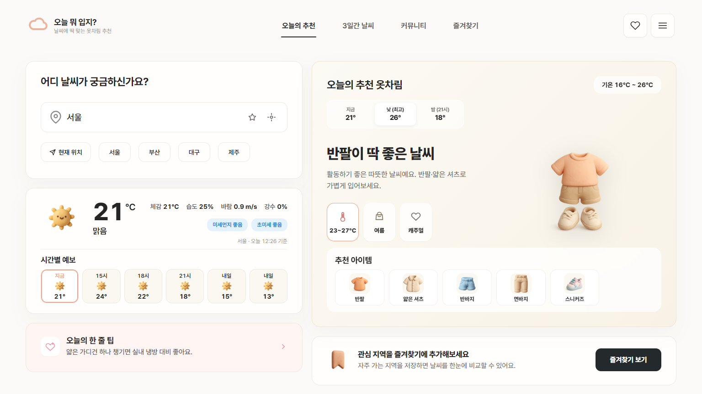
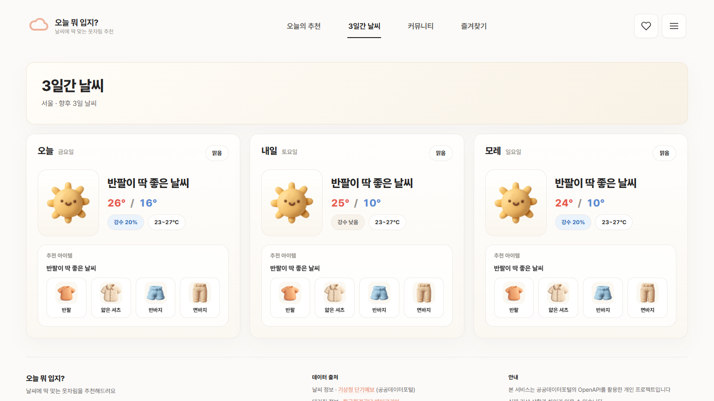
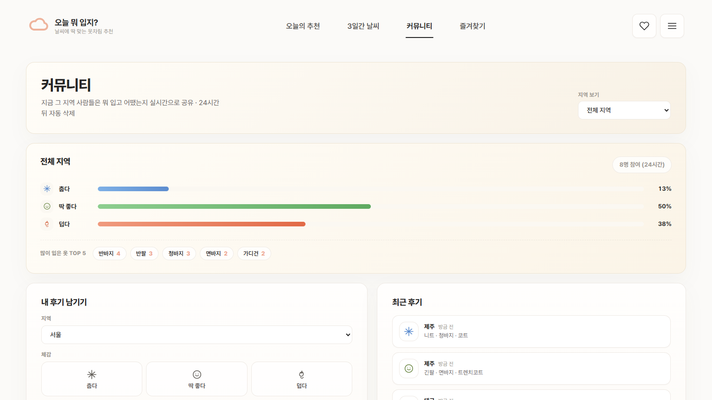
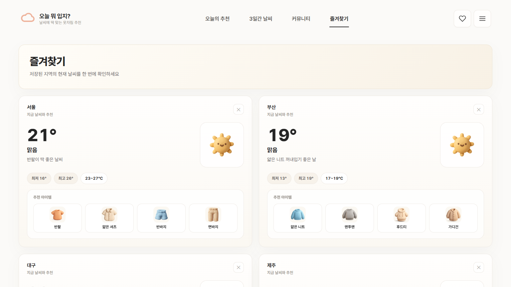

# 오늘 뭐 입지?

날씨에 딱 맞는 옷차림을 추천해주는 웹앱입니다.  
기상청 단기예보와 대기질 데이터를 바탕으로 오늘의 추천 옷차림, 3일간 날씨, 커뮤니티 체감 후기, 즐겨찾기 지역 정보를 한 화면에서 볼 수 있습니다.

- Live: [https://oneul-mwo-ipji.onrender.com](https://oneul-mwo-ipji.onrender.com)
- Created by `vivis_ri`

## Preview

<table>
  <tr>
    <td></td>
    <td></td>
  </tr>
  <tr>
    <td></td>
    <td></td>
  </tr>
</table>

## Features

- 현재 날씨, 체감온도, 습도, 바람, 강수 확률, 미세먼지 정보 제공
- 시간대별 기온 변화에 맞춘 오늘의 옷차림 추천
- 3일간 날씨와 온도대별 추천 아이템 확인
- 지역별 체감 후기 공유 커뮤니티
- 최근 24시간 기준으로 자동 정리되는 커뮤니티 데이터
- 자주 보는 지역을 저장하는 즐겨찾기 기능
- 클레이 스타일 이미지 기반의 감성적인 UI

## Tech Stack

- Frontend: `HTML`, `CSS`, `Vanilla JavaScript`
- Backend: `Node.js`, `Express`
- Data: `기상청 단기예보`, `한국환경공단 에어코리아`
- Deploy: `Render`

## Run Locally

```bash
npm install
```

루트에 `.env` 파일을 만들고 공공데이터포털 인증키를 넣어주세요.

```env
KMA_API_KEY=your_service_key
```

서버 실행:

```bash
npm start
```

브라우저에서 아래 주소로 접속하면 됩니다.

```text
http://localhost:3000
```

## Main Sections

### 1. 오늘의 추천
- 현재 날씨와 시간대별 예보를 바탕으로 오늘 입기 좋은 옷차림을 추천합니다.
- 추천 온도 구간, 계절감, 상황 태그, 아이템 리스트를 함께 보여줍니다.

### 2. 3일간 날씨
- 오늘, 내일, 모레의 기온 변화와 추천 아이템을 카드 형태로 확인할 수 있습니다.

### 3. 커뮤니티
- 사용자가 `춥다 / 딱 좋다 / 덥다` 체감과 입은 옷을 공유할 수 있습니다.
- 후기는 최근 24시간 기준으로 유지되어 지금 분위기를 빠르게 볼 수 있습니다.

### 4. 즐겨찾기
- 자주 확인하는 지역을 저장해두고 날씨를 빠르게 비교할 수 있습니다.

## Project Structure

```text
.
├─ index.html
├─ style.css
├─ script.js
├─ server.js
├─ clothing.js
├─ items.js
├─ images/
└─ docs/screenshots/
```

## Data Source

- 기상청 단기예보 API
- 한국환경공단 에어코리아
- 공공데이터포털 OpenAPI

## Notes

- 이 프로젝트는 개인 포트폴리오 성격의 사이드 프로젝트입니다.
- 실제 기상 상황 및 관측 시점에 따라 화면의 정보는 달라질 수 있습니다.

## Author

**vivis_ri**  
© 오늘 뭐 입지?
